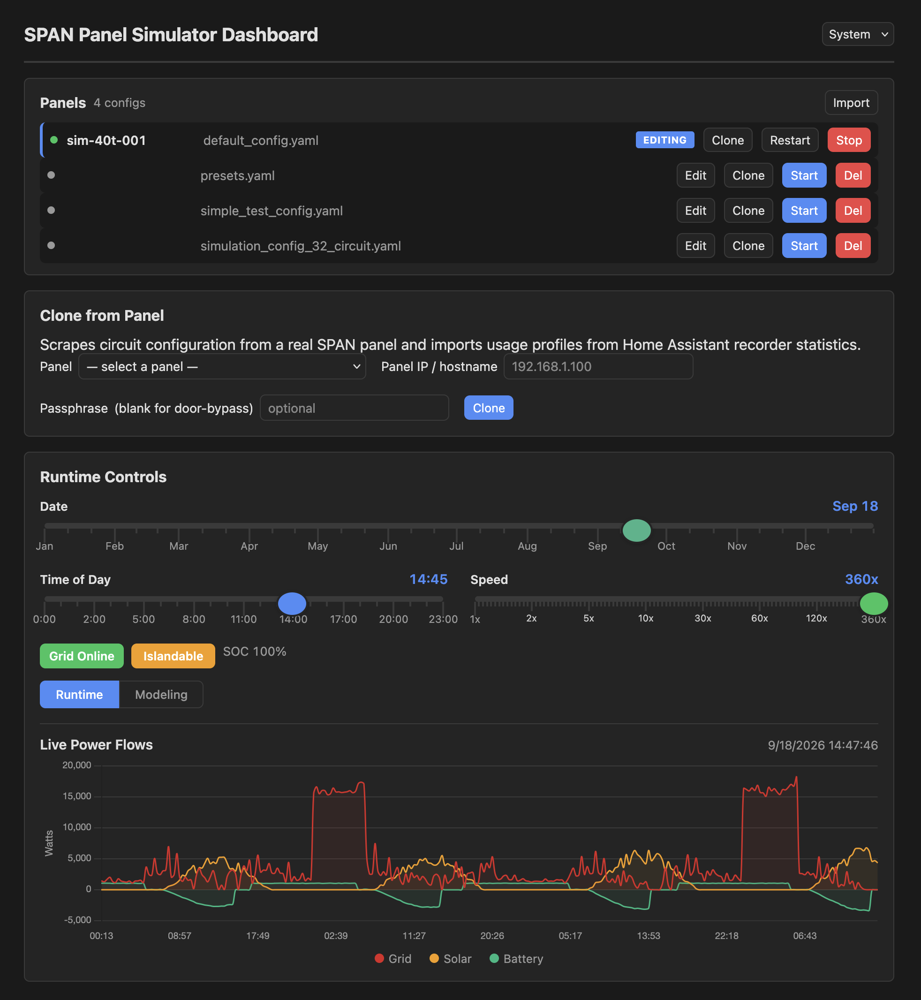
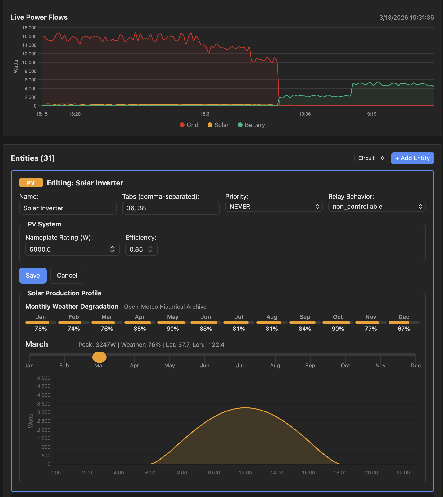
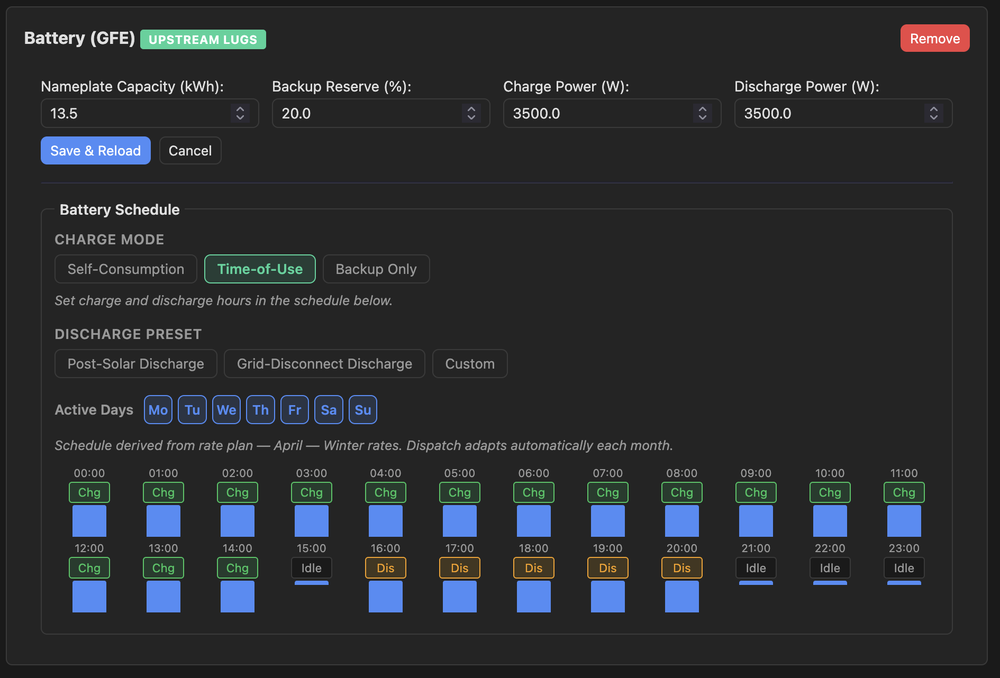

# SPAN Panel Simulator

A standalone eBus simulator that mimics real SPAN panel behavior: mDNS
discovery, bootstrap HTTP API, TLS certificate provisioning, and Homie v5
MQTT publishing.

Includes a web dashboard for real-time configuration, grid simulation,
and energy modeling.







## Quick Start (macOS)

```bash
# Prerequisites
brew install mosquitto uv

# Run
./scripts/run-local.sh

# Stop
./scripts/run-local.sh --stop

# Status
./scripts/run-local.sh --status
```

The script automatically:

- Creates a Python virtual environment via `uv` and installs the package
- Generates TLS certificates (with the host LAN IP in the SAN)
- Starts Mosquitto with MQTTS on port 18883
- Starts the simulator with HTTP on port 8081 and mDNS advertising
- Detects your LAN IP from `en0`/`en1`

No `sudo` required.

## Dashboard

The simulator runs a web dashboard on port 18080 (`http://localhost:18080`).

### Features

- **Panel config** — serial number, tab count, main breaker size, geographic
  location with geocoding search, SOC shed threshold
- **Simulation controls** — time-of-day slider, speed acceleration (1x-360x),
  grid online/offline toggle, islandable toggle
- **Live power chart** — real-time grid, solar, and battery power flows
- **Energy projection** — modeling view with weekly/monthly/annual energy
  estimates based on configured circuits, PV, and battery
- **Entity management** — add, edit, delete circuits with per-type editors:
  - **PV** — nameplate capacity, geographic sine-curve solar model, monthly
    weather degradation from Open-Meteo historical data
  - **Battery** — nameplate capacity (kWh), backup reserve %, charge mode
    (Custom / Solar Generation / Solar Excess), discharge presets, 24-hour
    charge/discharge/idle schedule
  - **EVSE** — charging schedule with presets (Peak Solar, Evening, Night)
    or custom start/duration, 24-hour visual timeline
  - **Circuits** — typical power, 24-hour usage profile with presets,
    HVAC type selector for circuits with cycling patterns (seasonal
    power modulation based on latitude and system type)
- **Grid simulation** — toggle grid online/offline to test backup behavior:
  - With battery: BESS becomes dominant power source, load shedding activates
  - Without battery: panel goes offline (all circuits dead)
  - Islandable toggle controls whether PV operates during grid outage
- **Load shedding** — per-circuit shed priority matching the Homie v2 schema:
  - `OFF_GRID` circuits shed immediately when grid disconnects
  - `SOC_THRESHOLD` circuits shed when battery SOC drops below threshold
  - `NEVER` circuits stay on as long as battery has power
  - User relay overrides take precedence over shedding
- **Relay control** — click status dots to toggle circuit relays; changes
  from the dashboard or the HA integration (via MQTT) are reflected in both
- **Dark mode** — system, light, or dark theme with localStorage persistence
- **File operations** — import/export YAML, load configs, clone, save & reload
- **Panel cloning** — clone a real SPAN panel's configuration via the HA
  integration (see [Panel Cloning](#panel-cloning) below)

### Theme

A theme selector in the header supports three modes:

| Mode | Behavior |
|---|---|
| **System** | Follows OS light/dark preference |
| **Light** | Forces light theme |
| **Dark** | Forces dark theme |

## Home Assistant Add-on

The simulator can run as an HA add-on (app) so users with the `span-panel`
integration can spin up a simulated panel directly in their HA environment.

1. Go to **Settings > Add-ons > Add-on Store** > three-dot menu >
   **Repositories**
2. Add `https://github.com/electrification-bus/simulator`
3. Install **SPAN Panel Simulator** from the store
4. Configure options (config file, tick interval, log level) and start

The add-on runs the simulator in a container with its own Mosquitto broker.
The `span-panel` integration discovers it via mDNS just like a real panel.

## Running with Docker (Linux only)

```bash
docker compose up --build
```

Container-based approaches on macOS do not work for this simulator.
Both Colima and Apple's native `container` runtime use VM-based
networking that prevents containers from obtaining real LAN IPs.
mDNS advertisement requires direct LAN access, which only native
execution (`run-local.sh`) or Linux Docker with `macvlan` networking
can provide.

## Environment Variables

All variables can also be passed as CLI arguments (use `--help` to see the
full list).

| Variable | Default | Description |
|---|---|---|
| `CONFIG_DIR` | `./configs` | Directory containing panel YAML configs |
| `CONFIG_NAME` | `default_config.yaml` | Specific config file to load (omit to use default) |
| `TICK_INTERVAL` | `1.0` | Seconds between simulation ticks |
| `LOG_LEVEL` | `INFO` | `DEBUG`, `INFO`, `WARNING`, `ERROR` |
| `FIRMWARE_VERSION` | `spanos2/sim/01` | Reported firmware version |
| `HTTP_PORT` | `8081` | Bootstrap HTTP server port |
| `BROKER_PORT` | `18883` | MQTTS broker port |
| `BROKER_HOST` | `localhost` | MQTT broker hostname |
| `BROKER_USERNAME` | `span` | MQTT credentials |
| `BROKER_PASSWORD` | `sim-password` | MQTT credentials |
| `CERT_DIR` | `/tmp/span-sim-certs` | TLS certificate directory |
| `ADVERTISE_ADDRESS` | auto-detected | IP to advertise via mDNS |
| `ADVERTISE_HTTP_PORT` | same as `HTTP_PORT` | Port advertised via mDNS |
| `DASHBOARD_PORT` | `18080` | Dashboard web UI port |

## Panel Configuration

Each YAML file in the config directory defines one simulated panel. The
simulator scans the directory at startup and can hot-reload via the admin
API.

### Minimal Example

```yaml
panel_config:
  serial_number: "SPAN-TEST-001"
  total_tabs: 8
  main_size: 100

circuits:
  - id: "kitchen_outlets"
    name: "Kitchen Outlets"
    tabs: [1, 2]
    energy_profile:
      mode: "consumer"
      power_range: [0.0, 1800.0]
      typical_power: 150.0
      power_variation: 0.3
    relay_behavior: "controllable"
    priority: "NEVER"
```

### Full Schema

```yaml
panel_config:
  serial_number: str        # Unique panel serial (e.g., "SPAN-SIM-001")
  total_tabs: int           # Breaker tab count (8, 32, 64)
  main_size: int            # Main breaker amps (100, 150, 200)
  latitude: float           # Degrees north (default: 37.7)
  longitude: float          # Degrees east (default: -122.4)
  soc_shed_threshold: float # SOC % for SOC_THRESHOLD shedding (default: 20)

circuit_templates:          # Reusable template definitions
  template_name:
    energy_profile:
      mode: str             # "consumer" | "producer" | "bidirectional"
      power_range: [min, max]   # Watts (negative = production)
      typical_power: float      # Base power in watts
      power_variation: float    # Fraction (0.1 = +/-10%)
      efficiency: float         # 0.0-1.0 (optional, PV/battery)
      nameplate_capacity_w: float  # PV nameplate rating in watts
    relay_behavior: str     # "controllable" | "non_controllable"
    priority: str           # "NEVER" | "SOC_THRESHOLD" | "OFF_GRID"
    device_type: str        # "circuit" | "evse" | "pv" (default: "circuit")

    # Optional behavioral modules
    cycling_pattern:
      on_duration: int      # Seconds on
      off_duration: int     # Seconds off
    hvac_type: str          # "central_ac" | "heat_pump" | "heat_pump_aux"

    time_of_day_profile:
      enabled: bool
      peak_hours: [int]           # Hours 0-23
      hour_factors:               # Per-hour multiplier (0.0-1.0)
        0: 1.0
        6: 0.0
        18: 1.0
      hourly_multipliers:         # Alternate per-hour override
        6: 0.1
        12: 1.0

    smart_behavior:
      responds_to_grid: bool
      max_power_reduction: float  # 0.0-1.0

    battery_behavior:
      enabled: bool
      charge_mode: str            # "custom" | "solar-gen" | "solar-excess"
      nameplate_capacity_kwh: float  # Total battery capacity (default: 13.5)
      backup_reserve_pct: float      # Normal discharge floor % (default: 20)
      charge_efficiency: float       # 0.0-1.0 (default: 0.95)
      discharge_efficiency: float    # 0.0-1.0 (default: 0.95)
      charge_power: float
      discharge_power: float
      idle_power: float
      max_charge_power: float        # Used by solar-gen/solar-excess modes
      max_discharge_power: float
      charge_hours: [int]
      discharge_hours: [int]
      idle_hours: [int]

circuits:
  - id: str                 # Unique identifier
    name: str               # Human-readable name
    template: str           # References a circuit_templates key
    tabs: [int]             # Tab positions ([1] = 120V, [1, 3] = 240V)
    overrides:              # Override any template field
      typical_power: 500.0

unmapped_tabs: [int]        # Tab numbers with no circuit assigned

simulation_params:
  update_interval: int          # Seconds between snapshots (default: 5)
  time_acceleration: float      # 1.0 = real-time, 2.0 = double speed
  noise_factor: float           # Random noise fraction (0.02 = +/-2%)
  enable_realistic_behaviors: bool
```

### Shed Priority

Circuit shed priority controls backup behavior when the grid disconnects,
matching the Homie v2 schema (`shed-priority` property):

| Priority | Behavior |
|---|---|
| `NEVER` | Never shed — stays on as long as battery has power |
| `OFF_GRID` | Shed immediately when dominant power source leaves GRID |
| `SOC_THRESHOLD` | Shed when battery SOC drops below `soc_shed_threshold` |

The `soc_shed_threshold` in `panel_config` (default 20%) sets the SOC
percentage that triggers shedding for `SOC_THRESHOLD` circuits.

User relay overrides (from dashboard or MQTT) take precedence over
shedding — if a user closes a shed relay, shedding will not reopen it.

### Config Selection

By default, the simulator loads `default_config.yaml`. To use a different
config:

```bash
# Via environment variable
CONFIG_NAME=simple_test_config.yaml ./scripts/run-local.sh

# Via CLI argument
span-simulator --config simple_test_config.yaml
```

When no `--config` is specified and no `default_config.yaml` exists, all
YAML files in the config directory are loaded (one panel per file).

### Included Configs

| File | Serial | Tabs | Circuits | Description |
|---|---|---|---|---|
| `default_config.yaml` | `SPAN-SIM-40T-001` | 40 | 31 | Default: 2 SPAN Drives, battery, solar, full residential |
| `simple_test_config.yaml` | `SPAN-TEST-001` | 8 | 4 | Minimal test: lights, outlets, HVAC, solar |
| `simulation_config_32_circuit.yaml` | `SPAN-32-SIM-001` | 32 | 29 | Full residential with cycling, time-of-day, solar curves |

## Multi-Panel Limitations

The simulator can load multiple configs, but each panel shares the same
host IP and HTTP server. Since a real SPAN panel has its own IP, the
integration's discovery flow deduplicates panels that resolve to the same
address.

For true multi-panel simulation, assign separate IPs to the host:

```bash
# macOS — add an alias IP
sudo ifconfig en0 alias 192.168.7.27 255.255.255.0

# Run one simulator per IP
ADVERTISE_ADDRESS=192.168.7.26 CONFIG_DIR=./configs/panel1 ./scripts/run-local.sh
ADVERTISE_ADDRESS=192.168.7.27 CONFIG_DIR=./configs/panel2 ./scripts/run-local.sh
```

## HTTP API

### Bootstrap Endpoints (eBus v2)

These endpoints match the real SPAN panel's API exactly.

| Method | Path | Description |
|---|---|---|
| `GET` | `/api/v2/status` | Panel identity (`serialNumber`, `firmwareVersion`) |
| `POST` | `/api/v2/auth/register` | Returns MQTT credentials and broker details |
| `GET` | `/api/v2/certificate/ca` | Self-signed CA certificate (PEM) |
| `GET` | `/api/v2/homie/schema` | Homie v5 property schema |

Query `/api/v2/status?serial=XXX` to target a specific panel when multiple
are loaded.

The `/register` endpoint accepts any `hopPassphrase` value.

### Admin Endpoints

| Method | Path | Description |
|---|---|---|
| `POST` | `/admin/reload` | Hot-reload configs (add/remove/update panels) |
| `GET` | `/admin/panels` | List all running panels |

```bash
# Reload after editing configs
curl -X POST http://192.168.7.26:8081/admin/reload

# List panels
curl http://192.168.7.26:8081/admin/panels
```

## MQTT Topics

The simulator publishes Homie v5 messages on the eBus topic namespace:

```
ebus/5/{serial}/{node}/{property}
```

### Nodes

| Node | Description |
|---|---|
| `core` | Panel state: door, relay, voltages, grid status, dominant power source |
| `upstream-lugs` | Grid-facing: power, currents, energy |
| `downstream-lugs` | Load-facing: feedthrough power, currents |
| `{circuit-uuid}` | Per-circuit: relay, power, energy, shed-priority |
| `bess-0` | Battery: SOC, grid-state, capacity |
| `pv-0` | Solar inverter: nameplate capacity |
| `evse-0` | EV charger: status, lock state, advertised current |
| `power-flows` | Aggregated: PV, battery, grid, site power |

### Settable Properties

Control circuits by publishing to `/set` topics:

```bash
# Open a circuit relay
mosquitto_pub -t "ebus/5/SPAN-TEST-001/{uuid}/relay/set" -m "OPEN"

# Change shed priority
mosquitto_pub -t "ebus/5/SPAN-TEST-001/{uuid}/shed-priority/set" -m "OFF_GRID"

# Change dominant power source (triggers load shedding)
mosquitto_pub -t "ebus/5/SPAN-TEST-001/core/dominant-power-source/set" -m "BATTERY"
```

Relay and priority changes made via MQTT are reflected in the dashboard
in real time.

## Panel Cloning

The simulator can clone a real SPAN panel's configuration over its eBus.
The HA SPAN integration triggers cloning via the Socket.IO channel
(`/v1/panel` namespace, `clone_panel` event), providing the target panel's
address and passphrase. The simulator handles the rest: authenticating,
scraping MQTT topics, translating to a simulator config, and hot-reloading.

### How it works

1. The HA integration discovers the simulator via mDNS and connects over Socket.IO
2. Integration sends a `clone_panel` event with the panel host, passphrase, and HA location
3. Simulator authenticates with the panel (`/api/v2/auth/register`, `/api/v2/certificate/ca`)
4. Simulator connects to the panel's MQTTS broker and collects all retained eBus topics
5. Simulator translates the `$description` and property values into a YAML config
6. Config is written to `{config_dir}/{serial}-clone.yaml`, location/timezone applied, and the simulator reloads

### Socket.IO contract

**Namespace**: `/v1/panel`

**Event**: `clone_panel`

**Payload** (client sends):

```json
{
  "host": "192.168.1.100",
  "passphrase": "panel-passphrase",
  "latitude": 37.78,
  "longitude": -121.96
}
```

**Response** (success):

```json
{
  "status": "ok",
  "serial": "nj-2316-XXXX",
  "clone_serial": "sim-nj-2316-XXXX-clone",
  "filename": "nj-2316-XXXX-clone.yaml",
  "circuits": 16,
  "has_bess": true,
  "has_pv": true,
  "has_evse": false,
  "time_zone": "America/Los_Angeles"
}
```

**Response** (error):

```json
{
  "status": "error",
  "phase": "connecting",
  "message": "MQTTS connection refused: bad credentials"
}
```

### What gets cloned

- Panel identity (serial + `-clone` suffix), main breaker rating, panel size
- All circuits: name, tab position, breaker rating, relay behavior, priority
- Energy profile mode inferred from device feeds (PV → producer, BESS → bidirectional, EVSE → bidirectional)
- Battery behavior with sensible schedule defaults
- PV nameplate capacity and production profile
- EVSE night-charging time-of-day profile

The cloned config is a faithful starting point. Behavioral tuning (cycling
patterns, time-of-day profiles, smart behavior) can be adjusted via the
dashboard after cloning.

## Simulation Models

### Solar

PV circuits use a geographic sine-based model instead of hourly multipliers:

- Sunrise/sunset computed from latitude, longitude, and date
- Solar elevation angle determines instantaneous production factor
- Daily weather degradation from Open-Meteo historical cloud cover data
- Falls back to deterministic seed-based weather when no API data available

### HVAC Seasonal Modulation

Circuits with `hvac_type` set automatically adjust power draw by season
using a latitude-aware sinusoidal temperature model:

| HVAC Type | Summer | Winter | Why |
|---|---|---|---|
| `central_ac` | Full compressor (~100%) | Blower fan only (~15%) | Gas furnace handles heating |
| `heat_pump` | Full compressor (~100%) | COP reduces draw (~45%) | Heat pump efficiency in cold |
| `heat_pump_aux` | Full compressor (~100%) | Aux strips exceed cooling (~140%) | Resistive backup below ~35F |

The seasonal factor scales the base power before cycling is applied, so
the on/off duty cycle remains unchanged while the power magnitude varies.

### Battery (BSEE)

The Battery Storage Energy Equipment tracks real state-of-energy by
integrating power over time:

- **Charging**: `SOE += power * dt * charge_efficiency`
- **Discharging**: `SOE -= power * dt / discharge_efficiency`
- **Backup reserve**: Normal discharge stops at `backup_reserve_pct`
  (default 20%); only grid-disconnect emergencies drain to the 5% hard floor
- **Charge modes**: Custom (hour-based schedule), Solar Generation (tracks
  PV curve), Solar Excess (surplus after loads)

### Load Shedding

When the grid goes offline (dominant power source changes from GRID):

1. `OFF_GRID` priority circuits: relay opened immediately
2. `SOC_THRESHOLD` priority circuits: relay opened when SOC < threshold
3. `NEVER` priority circuits: remain on
4. Battery covers the load deficit (consumption minus PV production)
5. PV continues operating if panel is islandable, otherwise zeroed

User relay overrides take precedence -- closing a shed relay keeps it on.

## Development

See [DEVELOPER.md](DEVELOPER.md) for setup, pre-commit hooks, simulation
engine internals, and directory layout.
