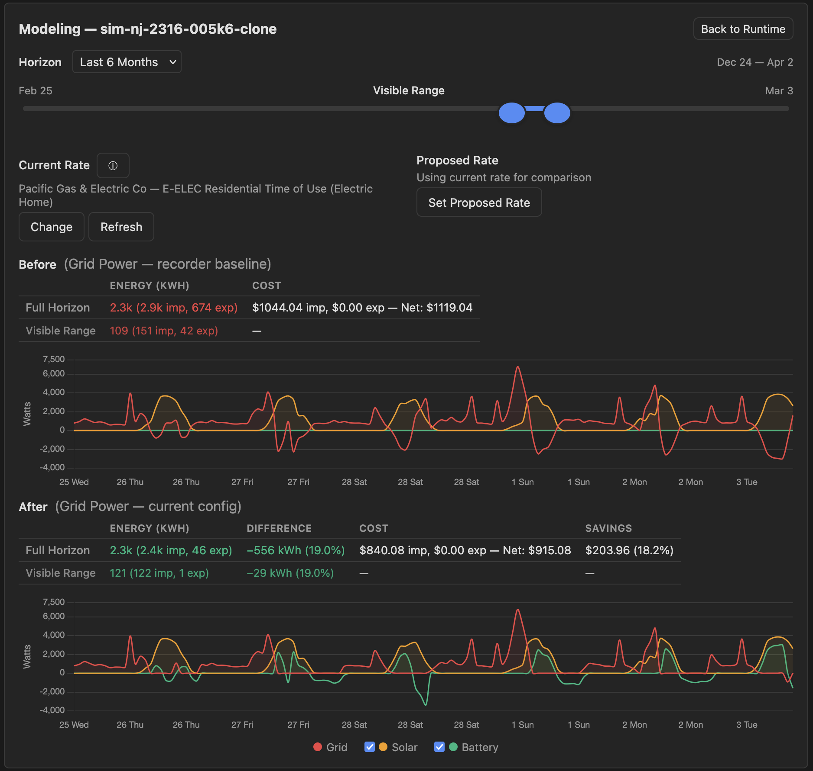

# SPAN Panel Simulator

A standalone simulator that mimics real SPAN panel behavior for
development and testing of the
[span-panel](https://github.com/SpanPanel/span-panel-api) Home Assistant
integration. Provides mDNS discovery, bootstrap HTTP API, TLS
certificates, and Homie v5 MQTT publishing — everything HA needs to
discover and connect to a panel.

Includes a web dashboard for real-time configuration, grid simulation,
recorder replay, and energy modeling.




## Quick Start (macOS)

```bash
# Prerequisites
brew install mosquitto uv

# Run
./scripts/run-local.sh

# Run with debug logging
./scripts/run-local.sh --debug

# Stop / Restart / Status
./scripts/run-local.sh --stop
./scripts/run-local.sh --restart
./scripts/run-local.sh --status
```

The script automatically creates a Python virtual environment, generates
TLS certificates, starts Mosquitto (MQTTS on port 18883), and launches
the simulator with mDNS advertising on your LAN IP. No `sudo` required.

Open the dashboard at **http://localhost:18080**.

## Home Assistant App

The simulator can run as an HA app (add-on) so users with the
`span-panel` integration can spin up a simulated panel directly in
their HA environment.

1. Go to **Settings > Add-ons > Add-on Store** > three-dot menu >
   **Repositories**
2. Add `https://github.com/SpanPanel/simulator`
3. Install **SPAN Panel Simulator** from the store
4. Start the app — a default panel config is included
5. The `span-panel` integration discovers the simulated panel
   automatically via mDNS
6. Open the web dashboard on port **18080** to configure the panel

The app runs the simulator in a container with its own Mosquitto broker.
No real SPAN hardware is needed.

## Running with Docker (Linux only)

```bash
docker compose up --build
```

Container-based approaches on macOS do not work for mDNS advertisement.
All macOS container runtimes use VM networking that prevents containers
from obtaining real LAN IPs. Use `run-local.sh` on macOS instead.

## Dashboard

The dashboard runs on port 18080 and provides full control over the
simulated panel.

### Panel Management

- **Multi-panel** — load multiple YAML configs, start/stop/restart
  individual panels
- **File operations** — import/export YAML, clone configs, save & reload
- **Panel cloning** — clone a real SPAN panel's configuration from
  the dashboard (enter the panel IP and passphrase)
- **Config persistence** — the simulator remembers the last running
  config across restarts

### Simulation Controls

- **Time-of-day slider** — scrub through the day to see solar curves,
  time-of-day profiles, and battery schedules respond
- **Speed acceleration** — 1x to 360x time acceleration
- **Grid online/offline** — toggle to test backup behavior and load
  shedding
- **Islandable toggle** — controls whether PV operates during grid
  outage
- **Live power chart** — real-time grid, solar, and battery power flows

### Recorder Replay

When connected to Home Assistant, the simulator replays recorded power
data from the HA recorder for circuits with mapped entities. This
grounds the simulation in actual household usage patterns rather than
synthetic profiles.

```bash
./scripts/run-local.sh --ha-url http://192.168.1.10:8123 --ha-token YOUR_TOKEN
```

Circuits with recorder data show a **REC** badge in the entity list.
Clicking the badge toggles to **SYN** (synthetic) mode, where the
simulator uses the configured power profile instead of recorded data.
Click again to switch back to recorder replay. This lets you compare
how well a synthetic profile matches your real usage, or override a
specific circuit while keeping the rest on recorded data.

### Energy Modeling

The modeling view lets you answer "what if" questions about adding solar
or battery storage to your panel. Clone your real panel, then add or
modify PV and Battery entities to see the projected impact on your grid
consumption over historical data.

**Typical workflow:**

1. Clone your real SPAN panel from the dashboard
2. Connect to HA so circuits replay actual recorded power data
3. Click **Model** on the running panel to enter the modeling view
4. The **Before** chart shows your site power as-is (loads minus any
   existing solar)
5. Add a Battery entity (or modify an existing one) — adjust capacity,
   charge/discharge schedule, and backup reserve
6. The **After** chart immediately updates to show grid power with the
   BESS applied, along with kWh savings
7. Add or resize a PV entity to see how additional solar offsets your
   consumption in the Before chart
8. Experiment with different battery sizes, charge modes, and PV
   nameplate ratings — charts auto-refresh on every save

**Modeling controls:**

- **Horizon selector** — last month, 3 months, 6 months, or 1 year
- **Range zoom** — drag the slider to zoom into any time window
- **Circuit overlays** — check individual circuits in the entity list
  to overlay their power traces on both charts
- **Toggleable legend** — show/hide Solar and Battery traces
- **Energy summary** — net kWh with import/export breakdown and savings
  percentage

### Entity Management

Add, edit, and delete circuits with specialized editors per type:

- **PV** — nameplate capacity, geographic sine-curve solar model,
  monthly weather degradation from Open-Meteo historical data
- **Battery** — nameplate capacity (kWh), backup reserve %, charge mode
  (Custom / Solar Generation / Solar Excess), discharge presets,
  24-hour charge/discharge/idle schedule
- **EVSE** — charging schedule with presets (Peak Solar, Evening, Night)
  or custom start/duration, 24-hour visual timeline
- **Circuits** — typical power, 24-hour usage profile with presets,
  HVAC type selector with seasonal power modulation

PV and Battery are singleton types — only one of each can exist per
panel. Recorder-sourced entities preserve their original panel settings
(priority, relay behavior) as read-only.

### Relay Control and Load Shedding

- Click status dots to toggle circuit relays
- Changes from the dashboard or HA integration (via MQTT) are reflected
  in both directions
- Grid offline triggers load shedding by priority:
  `OFF_GRID` circuits shed immediately, `SOC_THRESHOLD` circuits shed
  when battery SOC drops below threshold, `NEVER` circuits stay on

### Theme

System, light, or dark theme via the header selector, with localStorage
persistence.

## Panel Configuration

Each YAML file in the config directory defines one simulated panel.

### Minimal Example

```yaml
panel_config:
  serial_number: "SPAN-TEST-001"
  total_tabs: 8
  main_size: 100

circuit_templates:
  kitchen:
    energy_profile:
      mode: "consumer"
      power_range: [0.0, 1800.0]
      typical_power: 150.0
      power_variation: 0.3
    relay_behavior: "controllable"
    priority: "NEVER"

circuits:
  - id: "kitchen_outlets"
    name: "Kitchen Outlets"
    template: "kitchen"
    tabs: [1, 3]

unmapped_tabs: [2, 4, 5, 6, 7, 8]

simulation_params:
  update_interval: 5
```

### Config Selection

By default, the simulator loads `default_config.yaml`. To use a different
config:

```bash
CONFIG_NAME=simple_test_config.yaml ./scripts/run-local.sh
```

The simulator remembers the last running config and resumes it on
restart. When no config is specified and no default exists, all YAML
files in the config directory are loaded.

### Included Configs

| File | Tabs | Description |
|---|---|---|
| `default_config.yaml` | 40 | Full residential with solar, battery, EVSE |
| `simple_test_config.yaml` | 8 | Minimal test: lights, outlets, HVAC, solar |
| `simulation_config_32_circuit.yaml` | 32 | Full residential with cycling and time-of-day profiles |

## Environment Variables

All variables can also be passed as CLI arguments (`--help` for full list).

| Variable | Default | Description |
|---|---|---|
| `CONFIG_DIR` | `./configs` | Directory containing panel YAML configs |
| `CONFIG_NAME` | `default_config.yaml` | Specific config file to load |
| `TICK_INTERVAL` | `1.0` | Seconds between simulation ticks |
| `LOG_LEVEL` | `INFO` | `DEBUG`, `INFO`, `WARNING`, `ERROR` |
| `HTTP_PORT` | `8081` | Bootstrap HTTP server port |
| `DASHBOARD_PORT` | `18080` | Dashboard web UI port |
| `BROKER_HOST` | `localhost` | MQTT broker hostname |
| `BROKER_PORT` | `18883` | MQTTS broker port |
| `ADVERTISE_ADDRESS` | auto-detected | IP to advertise via mDNS |

## Development

See [DEVELOPER.md](DEVELOPER.md) for setup, testing, pre-commit hooks,
full config schema, HTTP/MQTT API reference, and simulation engine
internals.
